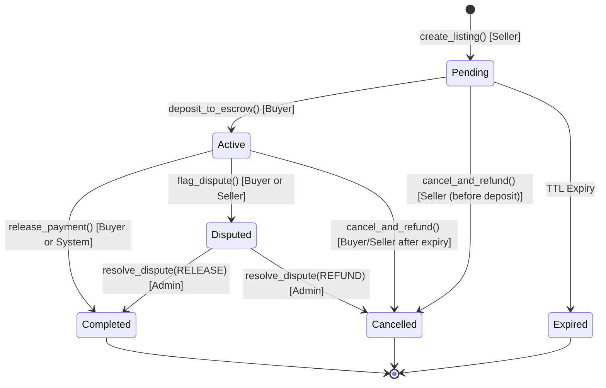

# AirFlex Soroban Contracts Audit Preparation Document

This preparation document provides security auditors with comprehensive scope, architecture details, access control matrices, state machine definitions, and known risk areas for the AirFlex Soroban smart contracts.

---

## 1. Scope

### Contract Files
- **Escrow Contract**: `contracts/escrow/src/lib.rs` (Escrow & partial fill engine)
- **Marketplace Contract**: `contracts/marketplace/src/lib.rs` (Peer-to-peer listing & reputation contract)

### Commit Range & Target Network
- **Target Network**: Stellar Mainnet / Testnet (Soroban Protocol Version 20+)
- **Commit Range**: `HEAD` (Latest main commit)

---

## 2. Architecture Overview & State Machine

AirFlex peer-to-peer airtime/data trades transition through discrete states defined by `TradeStatus`.

### `TradeStatus` State Machine Diagram

### Transition Triggers & Rules

| From State | To State | Trigger Function | Triggering Role | Conditions / Invariants |
|---|---|---|---|---|
| `[*] ` | `Pending` | `create_listing` | Seller | Funds/Asset listing initialized; valid expiry duration. |
| `Pending` | `Active` | `deposit_to_escrow` | Buyer | Buyer locks full/partial fill amount in Soroban escrow. |
| `Pending` | `Cancelled` | `cancel_and_refund` | Seller | Listing cancelled before buyer locks escrow; funds unlocked. |
| `Pending` | `Expired` | System / Time | Anyone | Block timestamp > `expires_at`. |
| `Active` | `Completed` | `release_payment` | Buyer / System | Delivery verified on-chain or buyer confirms receipt; payment released to seller. |
| `Active` | `Disputed` | `flag_dispute` | Buyer / Seller | Raised when off-chain delivery is contested before expiry. |
| `Active` | `Cancelled` | `cancel_and_refund` | Buyer / Seller | Triggered after expiry window without delivery confirmation. |
| `Disputed` | `Completed` | `resolve_dispute` | Admin | Admin resolves dispute in favor of seller (RELEASE). |
| `Disputed` | `Cancelled` | `resolve_dispute` | Admin | Admin resolves dispute in favor of buyer (REFUND). |

---

## 3. Access Control Matrix

| Contract Function | Anyone | Seller | Buyer | Admin | System |
|---|:---:|:---:|:---:|:---:|:---:|
| `initialize(admin, allowed_tokens)` | ❌ | ❌ | ❌ | ✅ (One-time) | ❌ |
| `pause()` | ❌ | ❌ | ❌ | ✅ | ❌ |
| `unpause()` | ❌ | ❌ | ❌ | ✅ | ❌ |
| `add_allowed_token(token)` | ❌ | ❌ | ❌ | ✅ | ❌ |
| `remove_allowed_token(token)` | ❌ | ❌ | ❌ | ✅ | ❌ |
| `create_listing(token, amount, price, ...)` | ❌ | ✅ | ❌ | ❌ | ❌ |
| `deposit_to_escrow(trade_id, fill_amount)` | ❌ | ❌ | ✅ | ❌ | ❌ |
| `release_payment(trade_id, fill_id)` | ❌ | ❌ | ✅ | ❌ | ✅ |
| `cancel_and_refund(caller, trade_id)` | ❌ | ✅ | ✅ | ❌ | ❌ |
| `flag_dispute(caller, trade_id)` | ❌ | ✅ | ✅ | ❌ | ❌ |
| `resolve_dispute(trade_id, resolution)` | ❌ | ❌ | ❌ | ✅ | ❌ |
| `get_trade(trade_id)` | ✅ | ✅ | ✅ | ✅ | ✅ |
| `get_listing(listing_id)` | ✅ | ✅ | ✅ | ✅ | ✅ |
| `get_reputation(user)` | ✅ | ✅ | ✅ | ✅ | ✅ |
| `is_paused()` | ✅ | ✅ | ✅ | ✅ | ✅ |

---

## 4. Known Assumptions and Limitations

1. **Off-Chain Telecom Delivery Verification**: The smart contract relies on an off-chain oracle service (or mutual agreement / automated verification processor) to verify telco airtime/data top-ups.
2. **Soroban Persistent Storage TTL**: Storage entries (`DataKey::Trade`, `DataKey::Listing`) must be bumped periodically to prevent archival.
3. **No Dynamic Price Feeds On-Chain**: Trade prices are fixed at listing creation time in NGN/XLM equivalent.

---

## 5. External Dependencies

- **Soroban SDK**: `soroban-sdk` version `20.0.0` or higher.
- **Stellar Asset Contract (SAC)**: Standard Soroban token contract interface for ERC-20 / SAC asset transfers (`token::Client`).

---

## 6. Test Coverage Summary

- **Unit Tests**: Full state transition coverage in `contracts/escrow/src/lib.rs` tests and `contracts/marketplace/src/lib.rs` tests.
- **Integration Tests**: Simulated full lifecycle runs (listing creation → escrow lock → dispute → resolution / refund).
- **Error Code Invariants**: Verified in accordance with [ERROR_CODES.md](./ERROR_CODES.md).

---

## 7. Questions for Auditors

1. **Storage Entry Expiry & TTL Edge Cases**: Are there any race conditions where `DataKey::Trade` entries expire during an active dispute before `resolve_dispute` is executed?
2. **Partial Fill Arithmetic & Precision Loss**: When a trade is partially filled across multiple buyers, can rounding issues or integer overflow occur in `amount * price` calculations?
3. **Replay & Front-Running Vulnerabilities**: Does `deposit_to_escrow` allow front-running by malicious buyers when gas prices fluctuate or during network congestion?
4. **Reentrancy Protection**: Are token transfers via `token::Client` safe against reentrancy if custom SAC tokens execute callbacks?

---

## 8. Error Codes Reference

For a complete breakdown of contract error codes and custom panic signals, see [ERROR_CODES.md](./ERROR_CODES.md).
